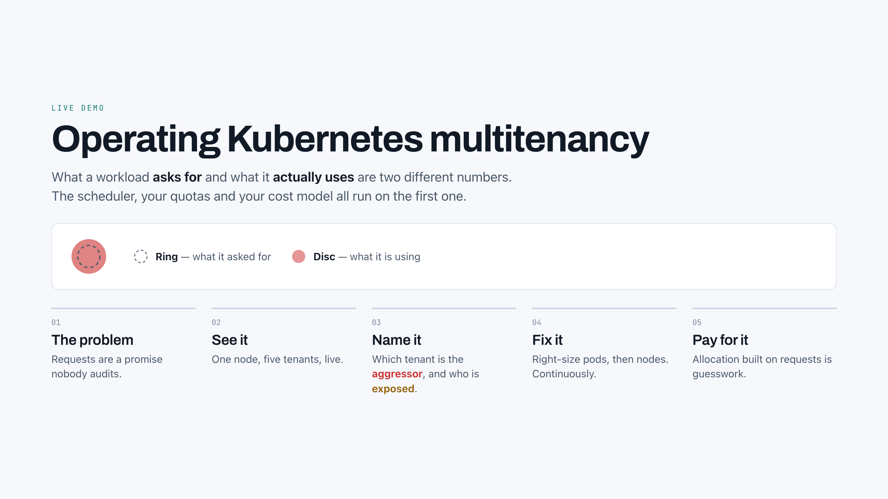
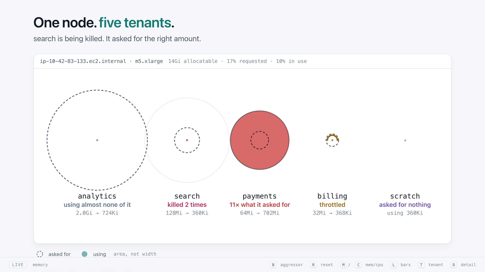
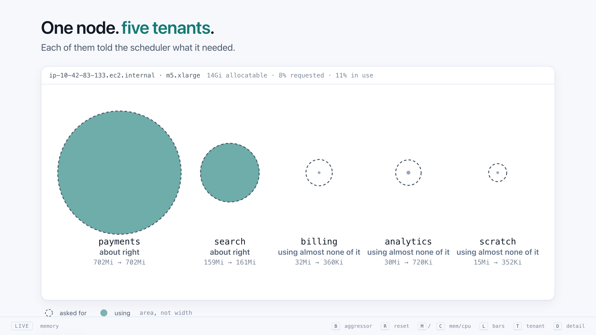
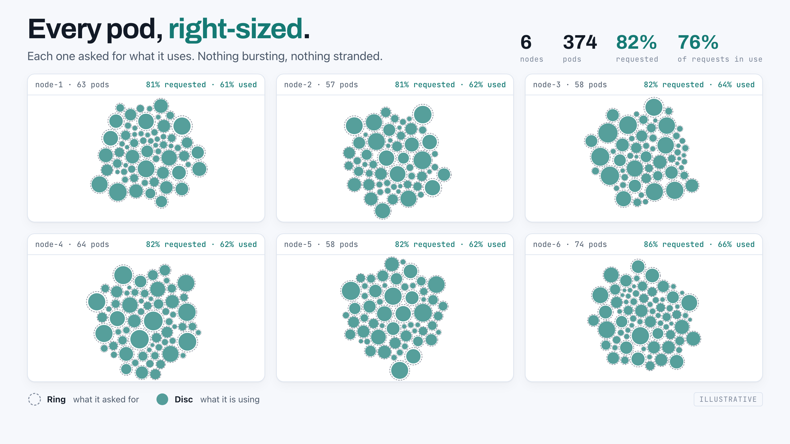
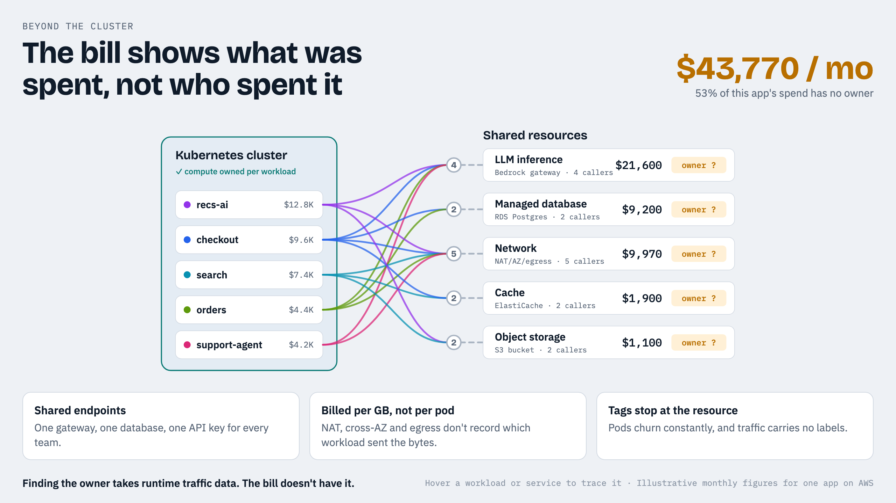

# Webinar: Operating Kubernetes multitenancy

Screens from the live session on 29 September 2026. There were no slides:
every screen was one of these pages or the running lab.

| | Screen | Source |
|---|---|---|
| 1 |  | [pages/intro.html](pages/intro.html) |
| 2 |  | `make wall` on the EKS lab, after `make eks-ps-before` |
| 3 |  | `make wall`, after `make eks-ps-after` |
| 4 |  | [pages/rightsized.html](pages/rightsized.html) |
| 5 |  | [pages/beyond-the-cluster.html](pages/beyond-the-cluster.html) |

## Reading the bubbles

A dashed ring is what a tenant asked for; a solid disc is what it uses, both
by area.

- **Before:** payments uses 11× its request, search is OOM-killed at its own
  128Mi limit, billing is throttled by its own 50m limit, analytics holds 2Gi
  it doesn't use, and scratch asks for nothing. No tenant kills another; the
  picture is co-tenancy and exposure.
- **After:** PerfectScale raised payments' and search's memory requests to
  what they use, trimmed analytics, gave scratch requests, and removed
  billing's CPU limit. All five changed within about three minutes of turning
  automation on.

Screens 4 and 5 are illustrative, not taken from a cluster or a bill.

## Reproducing them

```bash
open webinar/pages/intro.html              # 1
open webinar/pages/rightsized.html         # 4
open webinar/pages/beyond-the-cluster.html # 5
make wall-synth                            # a scripted stand-in for 2
```

Screens 2 and 3 need the EKS lab ([deploy/eks](../deploy/eks)) with the
PerfectScale agent installed and `make eks-ps-apply` run.
